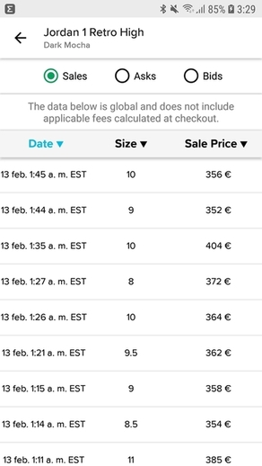
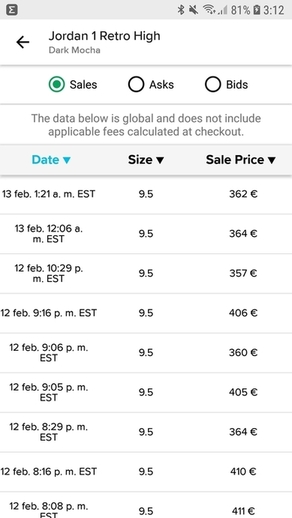
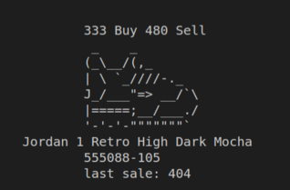

# StockX-Java

Este es un examen de grado superior DUAL de desarrollo web.

En este examen debíamos implementar algo parecido a StockX, que es una web real.

StockX es una web de compra-venta donde se subastan todo tipo de artículos. 

Este examen consistía en, principalmente, permitir al usuario crear filtros en una zapatilla específica.

El [repositorio del examen](https://github.com/dfleta/stockx-ascii)  es de [dfleta](https://github.com/dfleta), nuestro tutor. 

## Herramientas

Las herramientas que nos dio David Gelpi fueron:

- Diagrama UML
- Historias de usuario
- Salida por consola del main
- Clase StockX con el método main
- Método para dibujar el sneaker

## Propósito

Como ya se mencionó anteriormente, el propósito del examen es crear un programa que te permita filtrar por diferentes criterios una zapatilla.

- TDD
- Agilizar el uso de streams
- SOLID
- Interfaces
- Polimorfismo
- Principios básicos de POO
- Trabajar con listas

## Diagrama UML

Este es el diagrama UML proporcionado por Dfleta.

## Historias de usuario

Estas son las historias de usuario que debíamos cumplir.

## Salida por consola

Esta es la salida por consola esperada.

